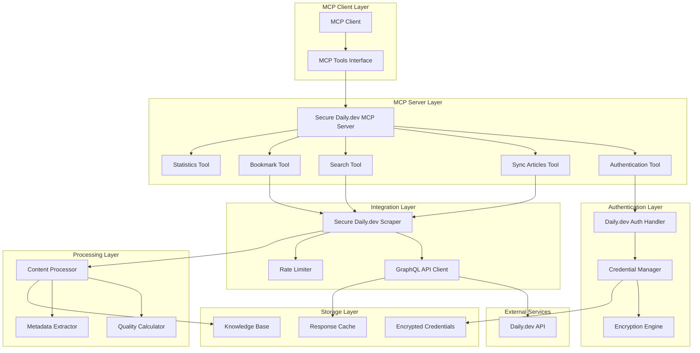

# Design Document

## Overview

The Secure Daily.dev MCP Authentication system provides a comprehensive solution for integrating Daily.dev content into AI workflows through the Model Context Protocol (MCP). The design emphasizes security, privacy, and ease of use while providing robust error handling and performance optimization.

The system consists of three main components: a secure credential management system with encryption, a Daily.dev API integration layer with authentication handling, and an MCP server that exposes Daily.dev functionality through standardized tools. All processing happens locally to maintain privacy, with strong encryption protecting stored credentials.

## Architecture

### High-Level System Architecture



### Components and Interfaces

#### 1. Credential Management System

**CredentialManager Class**
The core component responsible for secure credential storage and retrieval.

```python
class CredentialManager:
    def __init__(self, credentials_path: str = None):
        self.credentials_path = credentials_path or self._get_default_path()
        self.key_path = self._get_key_path()
        self.encryption_key = None
    
    def encrypt_credentials(self, credentials: Dict[str, Any], password: str) -> None:
        """Encrypt and store credentials using AES-256 encryption."""
        
    def decrypt_credentials(self, password: str) -> Dict[str, Any]:
        """Decrypt and retrieve stored credentials."""
        
    def _generate_key(self, password: str, salt: bytes) -> bytes:
        """Generate encryption key using PBKDF2 with SHA-256."""
        
    def clear_credentials(self) -> None:
        """Securely delete stored credentials."""
```

**Encryption Strategy**
- **Primary**: AES-256 encryption using the `cryptography` library
- **Key Derivation**: PBKDF2 with SHA-256, 100,000 iterations
- **Salt**: Random 16-byte salt stored separately
- **Fallback**: Base64 obfuscation with clear security warnings

**Security Features**
- Password-derived encryption keys
- Secure file permissions (600)
- Memory clearing after use
- Salt-based key derivation
- Graceful fallback for missing dependencies

#### 2. Daily.dev Authentication Handler

**DailyDevAuth Class**
Manages authentication state and session validation.

```python
class DailyDevAuth:
    def __init__(self):
        self.credential_manager = CredentialManager()
        self.credentials = {}
        self.session_valid_until = 0
    
    def login(self, password: str = None) -> bool:
        """Authenticate using stored credentials."""
        
    def is_authenticated(self) -> bool:
        """Check if current session is valid."""
        
    def get_auth_headers(self) -> Dict[str, str]:
        """Get HTTP headers for authenticated requests."""
        
    def get_auth_cookies(self) -> Dict[str, str]:
        """Get cookies for authenticated requests."""
        
    def store_credentials(self, credentials: Dict[str, Any], password: str) -> bool:
        """Store new authentication credentials."""
```

**Authentication Flow**
1. User extracts cookies from browser session
2. System validates cookies by testing API access
3. Credentials encrypted and stored locally
4. Session validity tracked with expiration
5. Automatic re-authentication prompts when expired

#### 3. Daily.dev API Integration

**SecureDailyDevScraper Class**
Handles all interactions with Daily.dev's GraphQL API.

```python
class SecureDailyDevScraper:
    def __init__(self, auth: DailyDevAuth):
        self.auth = auth
        self.session = requests.Session()
        self.base_url = "https://app.daily.dev"
        self.api_url = "https://app.daily.dev/api"
        self.rate_limiter = RateLimiter()
    
    def get_feed_articles(self, page: int, page_size: int, feed_type: str) -> List[Dict]:
        """Fetch articles from Daily.dev feeds."""
        
    def search_articles(self, query: str, limit: int) -> List[Dict]:
        """Search for articles on Daily.dev."""
        
    def get_user_bookmarks(self) -> List[Dict]:
        """Retrieve user's bookmarked articles."""
        
    def get_article_content(self, article_url: str) -> Optional[str]:
        """Fetch full article content."""
```

**GraphQL Queries**
The system uses Daily.dev's GraphQL API with these main queries:

```graphql
# Feed Articles Query
query Feed($first: Int, $after: String, $ranking: Ranking) {
  page: feed(first: $first, after: $after, ranking: $ranking) {
    edges {
      node {
        id
        title
        permalink
        summary
        createdAt
        readTime
        upvotes
        numComments
        tags
        source { name }
        author { name }
      }
    }
  }
}

# Search Query
query SearchPosts($query: String!, $first: Int) {
  search: searchPosts(query: $query, first: $first) {
    edges {
      node {
        id
        title
        permalink
        summary
        tags
        upvotes
        numComments
      }
    }
  }
}

# Bookmarks Query
query UserBookmarks($first: Int) {
  bookmarks: userBookmarks(first: $first) {
    edges {
      node {
        id
        title
        permalink
        summary
        tags
      }
    }
  }
}
```

#### 4. MCP Server Implementation

**SecureDailyDevMCPServer Class**
Implements the MCP protocol for Daily.dev integration.

```python
class SecureDailyDevMCPServer:
    def __init__(self):
        self.server = Server("dailydev-mcp-secure")
        self.dailydev_mcp = None
        self.knowledge_base = None
        self._setup_tools()
    
    def _setup_tools(self):
        """Register MCP tools with the server."""
        
    async def _authenticate(self, arguments: dict) -> List[TextContent]:
        """Handle authentication tool calls."""
        
    async def _sync_articles(self, arguments: dict) -> List[TextContent]:
        """Handle article synchronization tool calls."""
        
    async def _search_articles(self, arguments: dict) -> List[TextContent]:
        """Handle search tool calls."""
```

**MCP Tools Specification**

1. **authenticate_dailydev**
   - Purpose: Authenticate with stored credentials
   - Input: `password` (string, required)
   - Output: Authentication status and instructions

2. **sync_dailydev_articles**
   - Purpose: Sync articles from Daily.dev feeds
   - Input: `max_articles` (int, default: 50), `feed_types` (array, default: ["popular"])
   - Output: Sync statistics and results

3. **search_dailydev**
   - Purpose: Search Daily.dev and add results to knowledge base
   - Input: `query` (string, required), `limit` (int, default: 20)
   - Output: Search results and addition statistics

4. **sync_bookmarks**
   - Purpose: Sync user's bookmarks to knowledge base
   - Input: None
   - Output: Bookmark sync statistics

5. **get_dailydev_stats**
   - Purpose: Get integration statistics and status
   - Input: None
   - Output: Comprehensive status and metrics

6. **test_dailydev_connection**
   - Purpose: Test Daily.dev connection and authentication
   - Input: None
   - Output: Connection test results and diagnostics

#### 5. Content Processing System

**Content Transformation Pipeline**
Converts Daily.dev articles to knowledge base format.

```python
class ContentProcessor:
    def convert_article_to_content(self, article_node: Dict) -> EnhancedContent:
        """Convert Daily.dev article to EnhancedContent format."""
        
    def calculate_quality_score(self, article_node: Dict) -> float:
        """Calculate quality score based on engagement metrics."""
        
    def extract_metadata(self, article_node: Dict) -> Dict[str, Any]:
        """Extract and structure article metadata."""
```

**Quality Scoring Algorithm**
```python
def calculate_quality_score(self, article_node: Dict) -> float:
    base_score = 0.5
    upvotes = article_node.get('upvotes', 0)
    comments = article_node.get('numComments', 0)
    reading_time = article_node.get('readTime', 0)
    
    # Engagement scoring
    if upvotes > 10: base_score += 0.1
    if upvotes > 50: base_score += 0.1
    if upvotes > 100: base_score += 0.1
    
    # Discussion scoring
    if comments > 5: base_score += 0.05
    if comments > 20: base_score += 0.05
    
    # Content depth scoring
    if reading_time > 5: base_score += 0.05
    if reading_time > 10: base_score += 0.05
    
    return min(1.0, base_score)
```

### Data Models

#### Enhanced Content Model
```python
@dataclass
class EnhancedContent:
    content_id: str = ""
    source_type: ContentType = ContentType.DOCUMENT
    source_url: Optional[str] = None
    title: str = ""
    text_content: str = ""
    metadata: Dict[str, Any] = field(default_factory=dict)
    tags: List[str] = field(default_factory=list)
    quality_score: float = 0.0
    processing_method: str = ""
    created_at: datetime = field(default_factory=datetime.now)
    
    def add_tag(self, tag: str) -> None:
        if tag not in self.tags:
            self.tags.append(tag)
```

#### Credential Storage Model
```python
@dataclass
class StoredCredentials:
    cookies: Dict[str, str]
    headers: Dict[str, str]
    timestamp: float
    user_agent: str
    session_info: Dict[str, Any] = field(default_factory=dict)
```

#### Sync Statistics Model
```python
@dataclass
class SyncStatistics:
    total_articles_processed: int = 0
    articles_added: int = 0
    articles_updated: int = 0
    errors: int = 0
    last_sync_duration: float = 0.0
    last_sync_time: Optional[datetime] = None
```

### Error Handling

#### Error Categories and Responses

1. **Authentication Errors**
   - Invalid credentials: Clear re-authentication instructions
   - Expired session: Automatic re-authentication prompt
   - Missing credentials: Setup guidance

2. **Network Errors**
   - Connection timeout: Retry with exponential backoff
   - Rate limiting: Respect limits and queue requests
   - API changes: Graceful degradation with error reporting

3. **Processing Errors**
   - Invalid content: Skip with logging
   - Memory issues: Batch processing adjustment
   - Storage errors: Fallback mechanisms

#### Error Recovery Strategies

```python
class ErrorHandler:
    def __init__(self):
        self.retry_strategies = {
            'network_timeout': self.exponential_backoff_retry,
            'rate_limit': self.rate_limit_wait,
            'auth_expired': self.prompt_reauth,
            'api_error': self.graceful_degradation
        }
    
    def handle_error(self, error_type: str, context: Dict) -> Any:
        strategy = self.retry_strategies.get(error_type, self.default_handler)
        return strategy(context)
```

### Testing Strategy

#### Unit Testing
- **Credential Management**: Encryption/decryption, key derivation, secure deletion
- **Authentication**: Login flow, session validation, credential storage
- **API Integration**: GraphQL queries, response parsing, error handling
- **Content Processing**: Article conversion, quality scoring, metadata extraction

#### Integration Testing
- **End-to-End Authentication**: Complete setup and authentication flow
- **MCP Tool Testing**: All tool functions with various inputs
- **Error Scenario Testing**: Network failures, invalid credentials, API changes
- **Performance Testing**: Large sync operations, concurrent requests

#### Security Testing
- **Encryption Validation**: Key strength, secure storage, memory clearing
- **Authentication Security**: Session handling, credential protection
- **Input Validation**: Malicious input handling, injection prevention
- **Privacy Verification**: No credential leakage, local processing confirmation

```python
class SecurityTestSuite:
    def test_credential_encryption_strength(self):
        """Verify AES-256 encryption implementation."""
        
    def test_password_derivation_security(self):
        """Test PBKDF2 key derivation parameters."""
        
    def test_memory_clearing(self):
        """Ensure sensitive data is cleared from memory."""
        
    def test_file_permissions(self):
        """Verify secure file permissions on credential storage."""
```

### Performance Considerations

#### Rate Limiting Strategy
```python
class RateLimiter:
    def __init__(self):
        self.min_request_interval = 1.0  # 1 second between requests
        self.last_request_time = 0
        self.request_queue = Queue()
    
    def rate_limit(self):
        """Apply rate limiting between requests."""
        current_time = time.time()
        time_since_last = current_time - self.last_request_time
        if time_since_last < self.min_request_interval:
            time.sleep(self.min_request_interval - time_since_last)
        self.last_request_time = time.time()
```

#### Caching Strategy
- **Response Caching**: Cache API responses for 5 minutes
- **Authentication Caching**: Cache valid sessions for 24 hours
- **Content Caching**: Cache processed content to avoid reprocessing

#### Memory Management
- **Batch Processing**: Process articles in batches of 20
- **Streaming**: Process large datasets without loading everything into memory
- **Cleanup**: Automatic cleanup of temporary data and expired caches

### Security and Privacy

#### Data Protection Measures
1. **Local Processing**: All operations happen locally
2. **Encryption at Rest**: AES-256 for stored credentials
3. **Secure Key Management**: PBKDF2 key derivation with salt
4. **Memory Protection**: Clear sensitive data after use
5. **File Permissions**: Restrictive permissions on credential files

#### Privacy Preservation
```python
class PrivacyManager:
    def sanitize_logs(self, log_message: str) -> str:
        """Remove sensitive information from log messages."""
        
    def secure_delete(self, file_path: str) -> None:
        """Securely delete files with sensitive data."""
        
    def validate_permissions(self, file_path: str) -> bool:
        """Ensure proper file permissions are set."""
```

### Deployment Architecture

#### Standalone Deployment
```
Secure Daily.dev MCP
├── MCP Server (Python)
├── Credential Manager (Encrypted Storage)
├── Daily.dev Scraper (API Client)
├── Content Processor
└── Knowledge Base Integration
```

#### Dependencies
- **Required**: `requests`, `mcp`, `pathlib`, `json`, `time`
- **Optional**: `cryptography` (for strong encryption)
- **Fallback**: Base64 obfuscation when cryptography unavailable

#### Installation Requirements
```bash
# Core dependencies
pip install requests mcp

# Security dependencies (recommended)
pip install cryptography

# Knowledge base integration
pip install chromadb sentence-transformers
```

This design provides a comprehensive, secure, and user-friendly solution for Daily.dev MCP integration while maintaining strong privacy and security standards throughout the system.